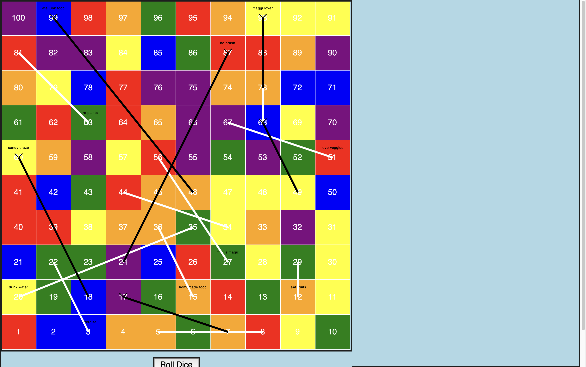

# Snake and Ladders Game 🎲

A multiplayer Snake and Ladders game built using Python and Tkinter.

## Features

- Supports 2–4 players
- Custom player names
- Interactive Tkinter GUI
- Snakes and ladders mechanics
- Dice rolling system
- Winner tracking
- Play Again functionality

## Technologies Used

- Python
- Tkinter

## Screenshots

## Screenshots

### Game Screen 1

### Game Screen 2

### Game Screen 3

## How to Play

1. Install Python 3 on your computer.
2. Download or clone this repository.
3. Open a terminal in the project folder.
4. Run:

Bash
python snake.py

5. Enter the number of players (2–4).
6. Enter player names.
7. Roll the dice and race to reach square 100.
8. Watch out for snakes and use ladders to climb faster!

The first player to reach square 100 wins the game.

## Author

Ayaan Kapoor
